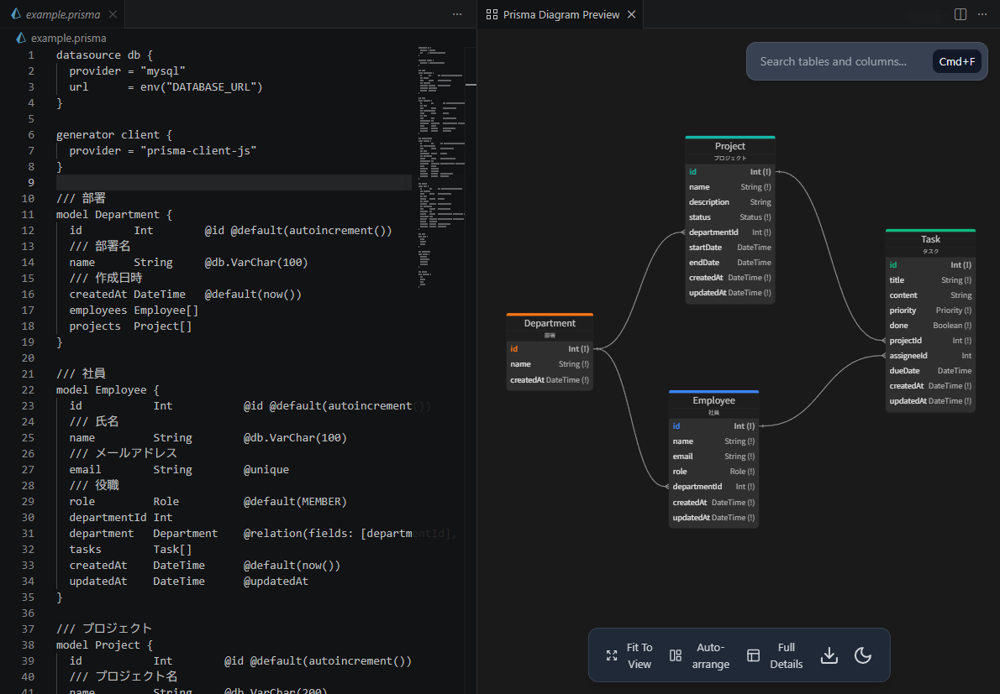

# Prisma ER Diagram Visualizer

Prisma スキーマファイル (`schema.prisma`) からインタラクティブな ER ダイアグラムを生成する VSCode 拡張機能です。



## 機能

- **ER ダイアグラム表示** - モデル、フィールド、リレーションを視覚的に表示
- **パン / ズーム** - マウスドラッグで移動、スクロールで拡大縮小
- **テーブルドラッグ** - テーブルを自由に配置
- **検索** - テーブル名・カラム名で検索 (`Cmd+F` / `Ctrl+F`)
- **テーマ切替** - ライト / ダークテーマ対応
- **詳細レベル切替** - Full Details / Key Only / Header Only
- **Auto-arrange** - dagre アルゴリズムによる自動レイアウト
- **PNG 出力** - ダイアグラムを画像としてダウンロード
- **自動更新** - `.prisma` ファイル保存時にダイアグラムを自動更新
- **`///` コメント対応** - モデル・フィールドのドキュメントコメントを表示

## 使い方

1. VSCode で `.prisma` ファイルを開く
2. コマンドパレット (`Cmd+Shift+P` / `Ctrl+Shift+P`) を開く
3. **「Prisma: Show ER Diagram」** を実行
4. エディタ右側に ER ダイアグラムが表示される

エディタのタイトルバーにあるプレビューアイコンからも起動できます。

## `///` コメント表示

Prisma の `///` ドキュメントコメントに対応しています。

```prisma
/// 医院（クリニック）
model Clinic {
  /// 一意識別子
  id    BigInt @id @default(autoincrement())
  /// 名前
  name  String
}
```

- **モデルコメント** → テーブルヘッダーの下にサブタイトルとして表示
- **フィールドコメント** → カラムにホバーするとツールチップとして表示

## 設定

| 設定項目 | 説明 | デフォルト |
|---------|------|-----------|
| `prismaERDPreviewer.preferredTheme` | テーマ (`dark` / `light`) | `dark` |
| `prismaERDPreviewer.scrollDirection` | ズーム方向 (`up-out` / `up-in`) | `up-out` |

## 開発

```bash
# 依存関係のインストール
npm install

# ビルド
npm run build

# デバッグ実行
# VSCode で F5 を押す
```

## クレジット

本プロジェクトは [BOCOVO/db-schema-visualizer](https://github.com/BOCOVO/db-schema-visualizer) (MIT License) をベースに開発されています。

## ライセンス

MIT License - 詳細は [LICENSE](LICENSE) をご覧ください。
